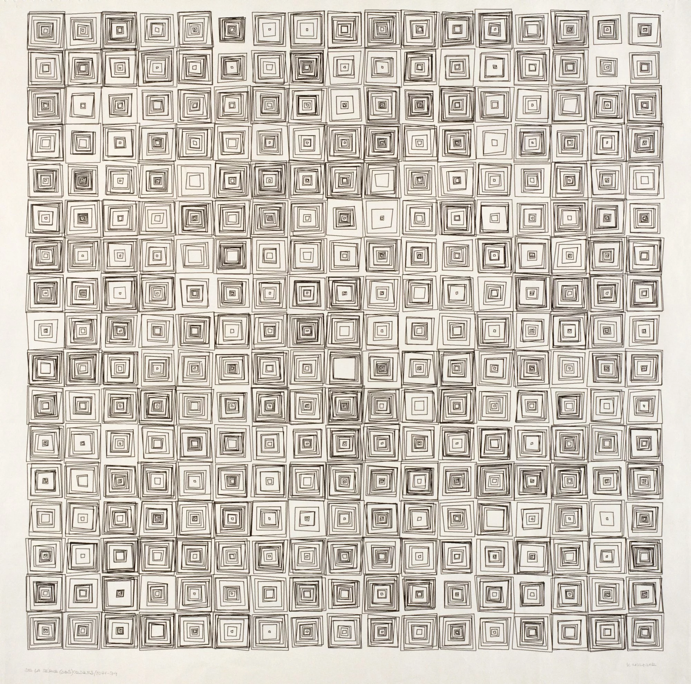

## Creative Coding Workshop
<!-- .slide: class=".uk-width-1-1 uk-height-large" -->  

Note:
Not only learn how to program, but also what to program, and why. It is important to learn computational literacy. Programming is no longer limited to being done by engineers. Now anyone can code. Not focusing on the utilitarian, but the expressive.

A creative coder is someone who chooses computer programming and custom software as their chosen media.

---

<!-- .slide: class=".uk-width-1-1" -->  
#### Workshop Website

<a href="https://juanedflores.github.io/Creative_Coding_Workshop/">https://juanedflores.github.io/Creative_Coding_Workshop/</a> <!-- .element: style="font-size:70px" -->

Note:
You can visit my website to follow along. There is a glossary here that you can reference as a kind of cheat sheet if any of my explanations are unclear.

---

<!-- .slide: class=".uk-width-1-1" -->  

 <!-- .element: width="450px;" style="margin: 0;" -->

Note:
I graduated from SAIC in the Art and Technology department as a grad student. So this workshop is about creative coding. So coding as you know refers to programming a computer to carry out instructions. What creative coding looks like could be many things. I want this topic and definition to be flexible to include different types of work that uses a computer to compute something.
In this picture I am doing a practice called live coding, which is a performance where you write code to generate visuals or sounds and the whole process is visible to an audience. There are several sub categories like that, for example another one is called size coding where the goal is to make a program that uses the most minimal amount of code in different types of computers.

---

<!-- .slide: class=".uk-width-1-1" -->  

<iframe width="800" height="515" src="https://www.youtube.com/embed/JOIkOTJrUXk?si=kCR4bT7DgsDYtUER&amp;controls=0?autoplay=1" title="YouTube video player" frameborder="0" allow="accelerometer; autoplay; clipboard-write; encrypted-media; gyroscope; picture-in-picture; web-share" allowfullscreen></iframe>

Note:
This is an example of what that could look like. This one was part of an online event where the performances were livestreamed. This was a collaboration with a friend from Mexico City. He was in charge of the sound while I was in charge of the visuals. In this example it's just a 3D shape that reacts to the sound and I am manipulating the geometry.

---

<!-- .slide: class=".uk-width-1-1" -->  

<iframe width="800" height="515" src="https://www.youtube.com/embed/U-XL7DiRlFc?si=VPVSVeugYhi4KzvV&amp;controls=0" title="YouTube video player" frameborder="0" allow="accelerometer; autoplay; clipboard-write; encrypted-media; gyroscope; picture-in-picture; web-share" allowfullscreen></iframe>

Note:
And of course it does not have to be live. This one was a website that someone could visit that would programmatically play videos of this communication between me and my collaborator. This was during the pandemic, and we tried to show our remote locations. While the videos are playing the background shows satelling photos of the cities where we were located. These were actually grabbed programmatically from NASA using something called an API, which is something that I want to cover today. In short, it is possible to grab from a huge repository of data and use it in your projects. NASA for example has a huge database of information from satellites, orbits, events, etc. You can also get weather data, facts about cats, wikipedia articles, news, gifs, almost anything.

---

#### P5js
<!-- .slide: class=".uk-width-1-1" -->  
 
 <!-- .element: width="650px;" style="margin: 0;" -->

Note:
I hope that by the very least, we know how to read and write a basic programming in p5JS.
- The internet, the browser as this powerful tool to make artwork that can be seen anywhere.

---

#### Computing without a Computer

<!-- .slide: class="uk-width-1-1 uk-column-1-2 uk-column-divider uk-vertical-align-middle" -->  
</img> <!-- .element: style="margin: 0;" -->
</img>

Note:
I want to challenge the idea that creative coding has to be digital. This is a work I did recently where I built a contraption that distorts the instructions that I follow for a walk using movement to generate a final image when it's done.

---

<!-- .slide: class="uk-width-1-1 uk-column-1-2 uk-column-divider uk-vertical-align-middle" -->  
</img> <!-- .element: style="margin: 0;" -->
</img>

---

#### Brief History
<!-- .slide: class=".uk-width-1-1" -->  

 <!-- .element: width="350px;" style="margin: 0;" -->

Note:
As I mentioned my home department during my time here was the department of Art & Technology Studies. When someone asks me what even is that I usually joke that I am not really sure myself. When you combine two ambigous and open ended words it creates this even more confusing category. It's a multi-layered. I guess that is where the studies comes in. I am still figuring this out, and it is constantly changing.

One safe assumption is that we use computers and other digital technologies. Though my last work challenges that a bit. These computers however are more powerful and accessible than ever and have become ubiquitous. But it is important to remember that it originally started in the military-industrial complex and big research centers. No one was able to afford these machines. I am thinking about when new tools like the printing press or the camera were invented and how artists started to make work with them.

---

<!-- .slide: class=".uk-width-1-1" -->  
#### "Wall Drawing #118" (1971)
##### Sol Lewitt

 <!-- .element: width="350px;" style="margin: 0;" -->

Note:

---

<!-- .slide: class=".uk-width-1-1" -->  
#### "Wall Drawing #118" (1971)
##### Sol Lewitt

 <!-- .element: width="850px;" style="margin: 0;" -->

Note:

---

<!-- .slide: class=".uk-width-1-1" -->  
#### "Wall Drawing #118" (1971)
##### Sol Lewitt

<embed type="image/jpg" src="https://igorkorenfeld.com/code/sol-lewitt/" width="900" height="700"> 

Note:

---

#### Solving Sol

 <embed type="image/jpg" src="https://solvingsol.com/" width="900" height="700"> 

---

 <!-- .slide: class=".uk-width-1-1" -->  
#### Untitled (1972)
##### Vera Molnar

  <!-- .element: width="350px;" style="margin: 0;" -->
  <!-- .element: width="350px;" style="margin: 0;" -->
 
Note:
In the 1960s, she began implementing simple algorithmic programmes by hand. Between 1959 and 1968, she worked with a method she referred to as machine imaginaire, a creative process with strict sets of rules that replaces humans in the artistic creation. This aided her in progressing systematically through all of the conceivable permutations of a series while adhering to a set of instructions and self-imposed constraints. v Trained as a traditional artist. One of the early pioneers of computer art. Governed by a predetermined set of mathematical rules that foreshadowed the development of computers. variations on a theme. Also drawing shapes because of the limitations of the computer. algorithmic artwork.  she defined a machine which works and generates artworks according to the programme based on given rules. mathematics, playfulness and coincidence came to play an important role in her artworks.

---

 <!-- .slide: class=".uk-width-1-1" -->  
#### (Des)Ordres (1972)
##### Vera Molnar
###### Variation

  <!-- .element: width="350px;" style="margin: 0;" -->
  <!-- .element: width="350px;" style="margin: 0;" -->
 
Note:
Using chance.

---

<!-- .slide: class=".uk-width-1-1" -->  
#### JODI
##### wwwwwwwww.jodi.org
###### Joan Heemskerk and Dirk Paesmans

<embed type="image/jpg" src="http://wwwwwwwww.jodi.org/" width="900" height="500"> 

Note:
Net Art. Their website is a landscape of intricate designs 

---

<!-- .slide: class=".uk-width-1-1" -->  
#### L.A.S.E.R. Tag (2007)
##### Graffiti Research Lab

<embed type="image/jpg" src="https://graffitiresearchlab.com/blog/projects/laser-tag/" width="900" height="700"> 

Note:

---

<!-- .slide: class=".uk-width-1-1" -->  
#### Add Art (2008)
##### Steve Lambert
###### Browser Extension

<embed type="image/jpg" src="https://visitsteve.com/made/add-art-art-replaces-ads/" width="900" height="700"> 

Note:

---

<!-- .slide: class=".uk-width-1-1" -->  
#### Favicon Diary (2014)
##### Shan Huang

 <!-- .element: width="850px;" style="margin: 0;" -->

Note:
Data Self-Portrait. Self Surveillance.

---

<!-- .slide: class=".uk-width-1-1" -->  
#### Exhausting a Crowd (2015)
##### Kyle McDonald

<embed type="image/jpg" src="https://www.exhaustingacrowd.com/berlin" width="900" height="500"> 

Note:
Collective Memory. Creative Crowdsourcing. Orchestration of large groups.

---

<!-- .slide: class=".uk-width-1-1" -->  
#### The Space Between Us (2015)
##### David Horvitz

 <!-- .element: width="650px;" style="margin: 0;" -->

Note:
Experimental Chat. Link between people.

---

<!-- .slide: class=".uk-width-1-1" -->  
#### Social Turkers (2013)
##### Lauren McCarthy

<embed type="image/jpg" src="https://lauren-mccarthy.com/Social-Turkers" width="900" height="500"> 

Note:
System for crowdsourced relationship feedback.

---

#### So Many Journeys May the Sun and Moon
##### R. Luke Dubois

<iframe width="860" height="515" src="https://www.youtube.com/embed/EpKoVCbONb8?si=NTJqNBcE4uQBhagg&amp;controls=0" title="YouTube video player" frameborder="0" allow="accelerometer; autoplay; clipboard-write; encrypted-media; gyroscope; picture-in-picture; web-share" allowfullscreen></iframe>

Note:
Making something happen at a specific time of the day.

---

#### Take a Bullet for This City (2014)
##### R. Luke Dubois

<embed type="image/jpg" src="https://www.lukedubois.com/projects-2/takeabullet" width="900" height="500"> 

Note:
Ways in which cities and government present that data to the public.  
an API is "a set of functions and procedures allowing the creation of applications that access the features of data of an operating system, application, or other service." Basically, an API is a way in which data gets exposed to the public.

---

#### Application Programming Interface (API)
- https://apilist.fun/

- https://github.com/public-apis/public-apis

---

#### P5js

<embed type="image/jpg" src="https://p5js.org/" width="900" height="500"> 

---

#### Basic Example
<!-- .slide: class="uk-column-1-2 uk-column-divider uk-vertical-align-middle" -->  

<pre>
<code>
function setup() {
  createCanvas(500, 500);
}

function draw() {
  background(125);
  ellipse(250, 250, 50);
}

</code> <!-- .element: class="data-line-numbers" style="font-size: 14px" data-line-numbers="|2-4|3|6-9|7|8" -->
</pre>

<embed type="text/html" src="p5js_sketches/basic/index.html" width="500px" height="500px">

---

#### Basic Example 2
##### fill()
<!-- .slide: class="uk-column-1-2 uk-column-divider uk-vertical-align-middle" -->  

<pre>
<code>
function setup() {
  createCanvas(500, 500);
}

function draw() {
  background(125);
  fill(30);
  ellipse(250, 250, 50);
}

</code> <!-- .element: class="data-line-numbers" style="font-size: 14px" data-line-numbers="8" -->
</pre>

<embed type="text/html" src="p5js_sketches/basic2/index.html" width="500px" height="500px">

---

#### Basic Example 3
##### stroke()
<!-- .slide: class="uk-column-1-2 uk-column-divider uk-vertical-align-middle" -->  

<pre>
<code>
function setup() {
  createCanvas(500, 500);
}

function draw() {
  background(125);
  fill(30);
  stroke(255);
  ellipse(250, 250, 50);
}

</code> <!-- .element: class="data-line-numbers" style="font-size: 14px" data-line-numbers="9" -->
</pre>

<embed type="text/html" src="p5js_sketches/basic3/index.html" width="500px" height="500px">

---

#### Basic Example 4
##### strokeWeight()
<!-- .slide: class="uk-column-1-2 uk-column-divider uk-vertical-align-middle" -->  

<pre>
<code>
function setup() {
  createCanvas(500, 500);
}

function draw() {
  background(125);
  fill(30);
  stroke(255);
  strokeWeight(5);
  ellipse(250, 250, 50);
}

</code> <!-- .element: class="data-line-numbers" style="font-size: 14px" data-line-numbers="10" -->
</pre>

<embed type="text/html" src="p5js_sketches/basic4/index.html" width="500px" height="500px">

---

#### Text
<!-- .slide: class="uk-column-1-2 uk-column-divider uk-vertical-align-middle" -->  

<pre>
<code>
function setup() {
  createCanvas(500, 500);
}

function draw() {
  background(125);
  text("Hello World", 250, 250);
}

</code> <!-- .element: class="data-line-numbers" style="font-size: 14px" data-line-numbers="|8" -->
</pre>

<embed type="text/html" src="p5js_sketches/text/index.html" width="500px" height="500px">

---

#### Text 2
##### textAlign()
<!-- .slide: class="uk-column-1-2 uk-column-divider uk-vertical-align-middle" -->  

<pre>
<code>
function setup() {
  createCanvas(500, 500);
}

function draw() {
  background(125);
  textAlign(CENTER);
  text("Hello World", 250, 250);
}

</code> <!-- .element: class="data-line-numbers" style="font-size: 14px" data-line-numbers="|8" -->
</pre>

<embed type="text/html" src="p5js_sketches/text2/index.html" width="500px" height="500px">

---

#### Text 3
##### textSize()
<!-- .slide: class="uk-column-1-2 uk-column-divider uk-vertical-align-middle" -->  

<pre>
<code>
function setup() {
  createCanvas(500, 500);
}

function draw() {
  background(125);
  textAlign(CENTER);
  textSize(26);
  text("Hello World", 250, 250);
}

</code> <!-- .element: class="data-line-numbers" style="font-size: 14px" data-line-numbers="|9" -->
</pre>

<embed type="text/html" src="p5js_sketches/text3/index.html" width="500px" height="500px">

---

#### Text 4
<!-- .slide: class="uk-column-1-2 uk-column-divider uk-vertical-align-middle" -->  

<pre>
<code>
function setup() {
  createCanvas(500, 500);
}

function draw() {
  background(125);
  textAlign(CENTER);
  textSize(26);
  fill(125, 20, 200);
  text("Hello World", 250, 250);
}

</code> <!-- .element: class="data-line-numbers" style="font-size: 14px" data-line-numbers="|10" -->
</pre>

<embed type="text/html" src="p5js_sketches/text4/index.html" width="500px" height="500px">

---

#### Variables
<!-- .slide: class="uk-column-1-2 uk-column-divider uk-vertical-align-middle" -->  

<pre>
<code>
let x_position = 0;

function setup() {
  createCanvas(500, 500);
}

function draw() {
  background(125);
  ellipse(x_position, 250, 50);
}

</code> <!-- .element: class="data-line-numbers" style="font-size: 14px" data-line-numbers="|2|10" -->
</pre>

<embed type="text/html" src="p5js_sketches/variables/index.html" width="500px" height="500px">

---

#### Variables 2
<!-- .slide: class="uk-column-1-2 uk-column-divider uk-vertical-align-middle" -->  

<pre>
<code>
function setup() {
  createCanvas(500, 500);
}

function draw() {
  background(125);
  ellipse(mouseX, 250, 50);
}

</code> <!-- .element: class="data-line-numbers" style="font-size: 14px" data-line-numbers="|8" -->
</pre>

<embed type="text/html" src="p5js_sketches/variables2/index.html" width="500px" height="500px">

---

#### Variables 3
##### mousePressed()
<!-- .slide: class="uk-column-1-2 uk-column-divider uk-vertical-align-middle" -->  

<pre>
<code>
let circle_color = 50;

function setup() {
  createCanvas(500, 500);
}

function mousePressed() {
  circle_color = circle_color + 50;
}

function draw() {
  background(125);
  fill(circle_color);
  ellipse(mouseX, 250, 50);
}

</code> <!-- .element: class="data-line-numbers" style="font-size: 14px" data-line-numbers="|2|8-9|14" -->
</pre>

<embed type="text/html" src="p5js_sketches/variables3/index.html" width="500px" height="500px">

---

#### Conditional Statements
<!-- .slide: class="uk-column-1-2 uk-column-divider uk-vertical-align-middle" -->  

<pre>
<code>
let circle_color = 50;

function setup() {
  createCanvas(500, 500);
}

function mousePressed() {
  if (circle_color < 255) {
    circle_color = circle_color + 50;
  } else {
    circle_color = 0;
  }
}

function draw() {
  background(125);
  fill(circle_color);
  ellipse(mouseX, 250, 50);
}

</code> <!-- .element: class="data-line-numbers" style="font-size: 14px" data-line-numbers="|2|8-9|14" -->
</pre>

<embed type="text/html" src="p5js_sketches/conditionals/index.html" width="500px" height="500px">

---

#### Images
<!-- .slide: class="uk-column-1-2 uk-column-divider uk-vertical-align-middle" -->  

<pre>
<code>
let img;

function preload() {
  img = loadImage('/assets/cat.jpg');
}

function setup() {
  createCanvas(500, 500);
}

function draw() {
  background(125);
  image(img, 0, 0);
}

</code> <!-- .element: class="data-line-numbers" style="font-size: 14px" data-line-numbers="|4-6|2|14" -->
</pre>

<embed type="text/html" src="p5js_sketches/images/index.html" width="500px" height="500px">

---

#### Images 2
<!-- .slide: class="uk-column-1-2 uk-column-divider uk-vertical-align-middle" -->  

<pre>
<code>
let img;

function preload() {
  img = loadImage('/assets/cat.jpg');
}

function setup() {
  createCanvas(500, 500);
}

function draw() {
  background(125);
  image(img, 0, 0, 250, 250);
}

</code> <!-- .element: class="data-line-numbers" style="font-size: 14px" data-line-numbers="14" -->
</pre>

<embed type="text/html" src="p5js_sketches/images2/index.html" width="500px" height="500px">

---

#### Images 3
<!-- .slide: class="uk-column-1-2 uk-column-divider uk-vertical-align-middle" -->  

<pre>
<code>
let img;

function preload() {
  img = loadImage('/assets/cat.jpg');
}

function setup() {
  createCanvas(500, 500);
}

function draw() {
  background(125);
  tint(255, 0, 0);
  image(img, 0, 0, 250, 250);
}

</code> <!-- .element: class="data-line-numbers" style="font-size: 14px" data-line-numbers="14" -->
</pre>

<embed type="text/html" src="p5js_sketches/images3/index.html" width="500px" height="500px">

---

#### random()
<!-- .slide: class="uk-column-1-2 uk-column-divider uk-vertical-align-middle" -->  

<pre>
<code>
let img;

function preload() {
  img = loadImage('/assets/cat.jpg');
}

function setup() {
  createCanvas(500, 500);
}

function draw() {
  background(125);
  tint(random(255), 0, 0);
  image(img, 0, 0, 250, 250);
}

</code> <!-- .element: class="data-line-numbers" style="font-size: 14px" data-line-numbers="14" -->
</pre>

<embed type="text/html" src="p5js_sketches/random/index.html" width="500px" height="500px">

---

#### random() 2
<!-- .slide: class="uk-column-1-2 uk-column-divider uk-vertical-align-middle" -->  

<pre>
<code>
function setup() {
  createCanvas(500, 500);
}

function draw() {
  background(200);
  strokeWeight(4);
  point(random(500), random(500));
}

</code> <!-- .element: class="data-line-numbers" style="font-size: 14px" data-line-numbers="14" -->
</pre>

<embed type="text/html" src="p5js_sketches/random2/index.html" width="500px" height="500px">

---

#### Arrays
<!-- .slide: class="uk-column-1-2 uk-column-divider uk-vertical-align-middle" -->  

<pre>
<code>
let fruits = ['Grape', 'Apple', 'Banana'];

function setup() {
  createCanvas(500, 500);
}

function draw() {
  background(125);
  text(fruits[0], 250, 250);
}

</code> <!-- .element: class="data-line-numbers" style="font-size: 14px" data-line-numbers="2" -->
</pre>

<embed type="text/html" src="p5js_sketches/arrays/index.html" width="500px" height="500px">

---

#### Weather
<!-- .slide: class="uk-column-1-2 uk-column-divider uk-vertical-align-middle" -->  

<pre>
<code>
let weather;
let country;

function preload() {
  weather = loadJSON('https://api.weatherapi.com/v1/forecast.json?key=89ea8c60f93041799fd194624230111&q=London&days=1&aqi=no&alerts=no');
}

function setup() {
  createCanvas(500, 500);
  console.log(weather);
  country = weather.location.name;
}

function draw() {
  background(210);
  text(country, 250, 250);
}

</code> <!-- .element: class="data-line-numbers" style="font-size: 14px" data-line-numbers="|2|6|3|12|11|17" -->
</pre>

<embed type="text/html" src="p5js_sketches/weather2/index.html" width="500px" height="500px">

---

#### Weather 2
<!-- .slide: class="uk-column-1-2 uk-column-divider uk-vertical-align-middle" -->  

<pre>
<code>
let weather;
let country;
let condition;

function preload() {
  weather = loadJSON('https://api.weatherapi.com/v1/forecast.json?key=89ea8c60f93041799fd194624230111&q=London&days=1&aqi=no&alerts=no');
}

function setup() {
  createCanvas(500, 500);
  console.log(weather);
  country = weather.location.name;
  condition = weather.current.condition.text;
}

function draw() {
  background(210);
  text("It's " + condition + ' in ' + country, 250, 250);
}

</code> <!-- .element: class="data-line-numbers" style="font-size: 14px" data-line-numbers="|4|14|19" -->
</pre>

<embed type="text/html" src="p5js_sketches/weather/index.html" width="500px" height="500px">

---

#### Incrementation
<!-- .slide: class="uk-column-1-2 uk-column-divider uk-vertical-align-middle" -->  

---

#### Ted Davis / Collaborative P5
<!-- .slide: class=".uk-width-1-1" -->  
<embed type="text/html" src="https://www.teddavis.org/" width="900px" height="600px">

---

#### Variable
<!-- .slide: class=".uk-width-1-1 uk-height-large uk-column-1-2 uk-column-divider uk-vertical-align-middle" -->  

<pre>
<code>
let x_position = 0;

</code> <!-- .element: class="data-line-numbers" style="font-size: 14px" data-line-numbers="18-22|29-37" -->
</pre>

A value that can change.

---

#### Array
<!-- .slide: class=".uk-width-1-1 uk-height-large uk-column-1-2 uk-column-divider uk-vertical-align-middle" -->  

<pre>
<code>
let fruits = ['Grape', 'Apple', 'Banana'];

// returns 'Grape'
fruits[0]

</code> <!-- .element: class="data-line-numbers" style="font-size: 14px" data-line-numbers="18-22|29-37" -->
</pre>

A collection of values. Each element in the array can be accessed via their index. First entry is index 0, second is 1 and so on.

---
